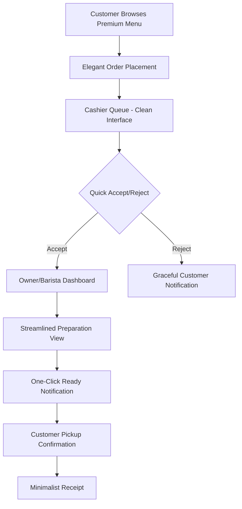
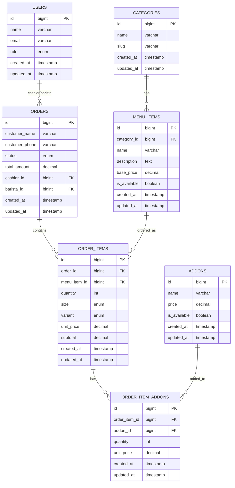

# Design Document

## Overview

The KlaséCo ordering system is a minimalist, premium coffee ordering platform built on Laravel with Inertia.js and React. Inspired by high-end clothing store aesthetics, the system features a sophisticated customer interface that presents coffee as premium products, alongside streamlined staff interfaces focused on efficiency and elegance. The application emphasizes clean design, smooth interactions, and a luxury retail experience adapted for coffee service.

## Architecture

### Technology Stack

-   **Backend**: Laravel 12 with Inertia.js
-   **Frontend**: React 18 with Tailwind CSS
-   **Database**: MariaDB
-   **Authentication**: Laravel Breeze
-   **Real-time Updates**: Polling (3-5 second intervals)
-   **Routing**: Ziggy for client-side routing

### System Flow



### Database Schema



## Components and Interfaces

### Customer Interface (Premium Mobile Experience)

**Route**: `/` (public boutique-style menu)

-   **PremiumMenuPage**: Minimalist menu with elegant product showcase
-   **ProductCategoryGrid**: Clean category sections with sophisticated typography
-   **CoffeeProductCard**: High-end product cards with premium imagery and refined details
-   **LuxuryCartDrawer**: Sophisticated cart experience with smooth animations
-   **OrderTrackingInterface**: Elegant order status with real-time updates
-   **MinimalistReceipt**: Clean, branded receipt design

### Cashier Interface (Streamlined Desktop)

**Route**: `/cashier` (simplified access)

-   **CleanCashierDashboard**: Minimal order queue with essential information
-   **OrderQueueList**: Simplified pending orders with quick-scan layout
-   **OrderSummaryCard**: Condensed order details for fast processing
-   **QuickActions**: One-click accept/reject with immediate feedback

### Owner/Barista Interface (Focused Desktop)

**Route**: `/owner` (consolidated barista/owner role)

-   **OwnerDashboard**: Streamlined preparation queue with active orders only
-   **ActiveOrdersGrid**: Clean grid of orders in preparation
-   **PreparationCard**: Focused order details for coffee preparation
-   **ReadyNotificationButton**: Prominent ready button with instant customer notification

### Shared Components

-   **MinimalistLayout**: Clean, white-space focused layout with subtle coffee accents
-   **ElegantLoader**: Sophisticated loading animations with coffee-inspired motion
-   **PremiumNotifications**: Subtle, non-intrusive notification system
-   **SeamlessPolling**: Background updates that maintain premium user experience

## Data Models

### Order Status Enum

```php
enum OrderStatus: string
{
    case PENDING = 'pending';           // Waiting for cashier
    case ACCEPTED = 'accepted';         // Accepted by cashier, sent to barista
    case PREPARING = 'preparing';       // Being prepared by barista
    case READY = 'ready';              // Ready for pickup
    case SERVED = 'served';            // Customer confirmed receipt
    case CANCELLED = 'cancelled';       // Rejected by cashier
}
```

### Size and Variant Enums

```php
enum Size: string
{
    case DAILY = 'daily';              // ₱70
    case EXTRA = 'extra';              // ₱90
}

enum Variant: string
{
    case HOT = 'hot';
    case COLD = 'cold';
}

enum UserRole: string
{
    case CUSTOMER = 'customer';
    case CASHIER = 'cashier';
    case BARISTA = 'barista';
    case ADMIN = 'admin';
}
```

### Pricing Logic

-   Base prices stored in menu_items table
-   Size multipliers: Daily (1.0x), Extra (1.3x ≈ ₱70 to ₱90)
-   Add-ons have fixed prices
-   Total calculation: (base*price * size*multiplier * quantity) + addon_prices

## Error Handling

### API Error Responses

-   **422 Validation Error**: Invalid form data
-   **404 Not Found**: Menu item or order not found
-   **403 Forbidden**: Insufficient permissions
-   **500 Server Error**: Database or system errors

### Frontend Error Handling

-   Form validation with real-time feedback
-   Network error retry mechanisms
-   Graceful degradation when polling fails
-   User-friendly error messages with toast notifications

### Order State Validation

-   Prevent invalid status transitions
-   Validate user permissions for actions
-   Check item availability before order placement
-   Ensure order integrity throughout workflow

## Testing Strategy

### Backend Testing (Pest)

-   **Unit Tests**: Model relationships and business logic
-   **Feature Tests**: API endpoints and order workflow
-   **Database Tests**: Migrations and seeders
-   **Authentication Tests**: Role-based access control

### Frontend Testing

-   **Component Tests**: React component rendering and interactions
-   **Integration Tests**: Order flow from customer to completion
-   **Polling Tests**: Real-time update functionality
-   **Responsive Tests**: Mobile and desktop interface validation

### Test Data

-   Seeded menu items across all categories
-   Test users for each role (customer, cashier, barista)
-   Sample orders in various states
-   Add-on combinations and pricing scenarios

## UI/UX Design

### Minimalist Color Palette (Premium Coffee Aesthetic)

```css
:root {
    --primary-white: #ffffff; /* Pure White */
    --warm-white: #fefefe; /* Warm White */
    --light-gray: #f8f9fa; /* Light Gray */
    --medium-gray: #6c757d; /* Medium Gray */
    --dark-gray: #343a40; /* Dark Gray */
    --coffee-accent: #8b4513; /* Subtle Coffee Brown */
    --gold-accent: #d4af37; /* Refined Gold */
    --success-green: #28a745; /* Clean Success */
}
```

### Typography (Sophisticated & Clean)

-   **Headers**: Modern sans-serif with generous spacing (Inter, Helvetica Neue)
-   **Body**: Clean, highly readable typography with optimal line height
-   **Prices**: Elegant number formatting with refined ₱ symbol
-   **Product Names**: Premium typography treatment with careful kerning

### Mobile-First Premium Experience

-   Large, elegant touch targets with subtle hover states
-   Smooth gesture interactions with premium feel
-   Generous white space and breathing room
-   High-quality product imagery with lazy loading
-   Sophisticated micro-animations

### Desktop Interface (Clean & Efficient)

-   Minimal, distraction-free layouts
-   Subtle shadows and borders for depth
-   Clean data tables with excellent readability
-   Focused workflows with clear visual hierarchy
-   Professional color coding for order states

## Real-time Updates (Seamless Polling)

### Elegant Polling Strategy

-   **Customer Interface**: Gentle 5-second polling with smooth state transitions
-   **Cashier Interface**: Efficient 3-second polling with subtle visual updates
-   **Owner Interface**: Focused 3-second polling for active orders only
-   **Smart Polling**: Adaptive frequency based on order activity and user engagement

### Streamlined Polling Endpoints

-   `GET /api/orders/pending` - Clean cashier queue data
-   `GET /api/orders/active` - Owner's active preparation queue
-   `GET /api/orders/{id}/status` - Customer order status with elegant formatting
-   `GET /api/orders/summary` - Minimal dashboard statistics

### Premium Performance Optimization

-   Sophisticated caching with ETag headers
-   Minimal JSON payloads for fast updates
-   Intelligent client-side state management
-   Graceful degradation with elegant error states
-   Background updates that don't interrupt user interactions

## Premium User Experience Design

### Customer Journey (Boutique Shopping Experience)

1. **Menu Discovery**: Elegant product grid with high-quality coffee imagery
2. **Product Selection**: Sophisticated customization interface with smooth animations
3. **Cart Experience**: Luxury shopping cart with refined checkout process
4. **Order Confirmation**: Premium confirmation with elegant order tracking
5. **Status Updates**: Sophisticated notifications with smooth transitions
6. **Pickup Experience**: Clean, one-tap confirmation with minimalist receipt

### Staff Workflow Optimization

#### Cashier Experience

-   **Quick Scan**: Essential order information at a glance
-   **One-Click Actions**: Immediate accept/reject with visual feedback
-   **Clean Queue**: Minimal interface focused on efficiency
-   **Smooth Updates**: Background refreshes without disruption

#### Owner/Barista Experience

-   **Focused Dashboard**: Only active orders, no clutter
-   **Preparation Details**: Clear, scannable order information
-   **Ready Notification**: Prominent button with instant customer notification
-   **Status Clarity**: Visual indicators for order progress

### Interaction Design Principles

-   **Subtle Animations**: Smooth transitions that enhance rather than distract
-   **Generous Spacing**: Breathing room that creates premium feel
-   **Consistent Feedback**: Clear visual responses to all user actions
-   **Error Prevention**: Intuitive design that prevents mistakes
-   **Accessibility**: High contrast, readable fonts, keyboard navigation

## Security Considerations

### Authentication & Authorization

-   Simple role-based access for staff (cashier/barista) using session tokens
-   No authentication required for customers (public menu access)
-   CSRF protection on all forms
-   Order tracking using order numbers instead of user accounts

### Data Validation

-   Server-side validation for all inputs
-   Sanitization of user-provided data
-   Price calculation verification
-   Order state transition validation

### API Security

-   Rate limiting on polling endpoints
-   Input sanitization and validation
-   Proper error message handling
-   Secure session management
